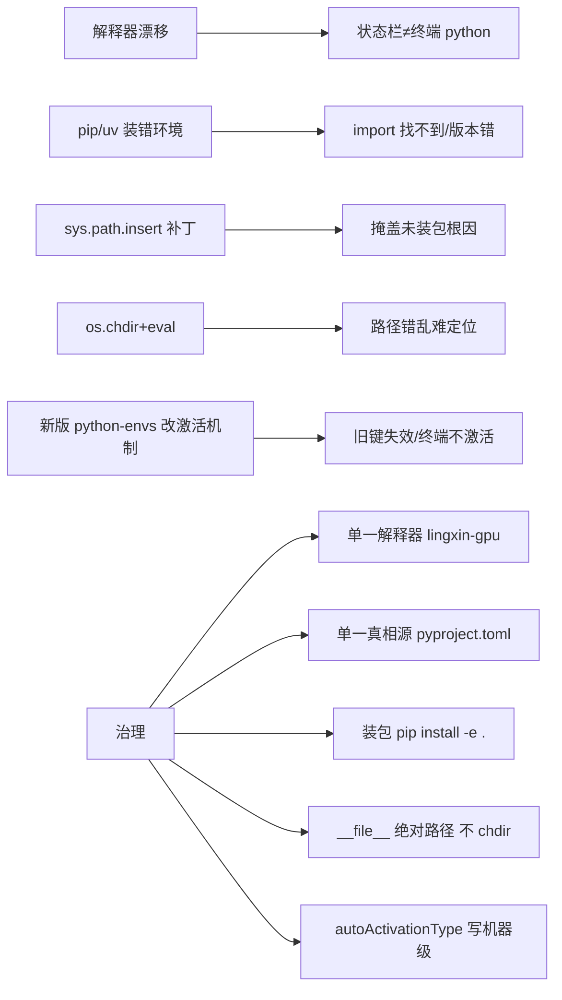

# 11 · Python 环境与导入检查规范

> 适用范围：lingxin 项目（Windows）。
> 目标运行环境：conda 环境 **`lingxin-gpu`**（Miniconda 位于 `D:\APP\miniconda3`）。

---

## 0. 机器真实现状

- 仅 Miniconda 为用户手动安装：`D:\APP\miniconda3`。
- 现有 conda 环境：`base`、`Agent`、`Game`、`lingxin-gpu`、`main`、`spider`、`work`、`zhudi-dev`、`zotero-pdf2zh-next-venv`。
- Windows 遗留系统 Python 3.11.15：非用户主动安装，Windows 自带/附属遗留，被动存在。
- `uv 0.12.1`：是 conda 环境内 pip 安装的工具，**不是独立安装的管理器**；`uv` 可以生成项目本地 `.venv`。

---

## 1. 环境根因与风险分析

### 1.1 三类 Python 执行体

| 执行体 | 典型路径 | 来源 | 是否本项目目标 |
| --- | --- | --- | --- |
| Miniconda conda 环境 | `D:\APP\miniconda3\python.exe`（base）、`D:\APP\miniconda3\envs\<env>\python.exe` | 用户手动安装 | 是（`lingxin-gpu`） |
| Windows 遗留系统 Python | `C:\Users\<user>\AppData\Local\Programs\Python\Python311\python.exe` 或系统目录 | 系统自带/附属遗留 | 否，禁止使用 |
| uv 生成的项目 `.venv` | `<项目>\.venv\Scripts\python.exe` | `uv sync` 等命令生成 | 本项目不采用 |

关键点：`uv` 只是 conda 内安装的一个工具，它本身是"安装器"，不是环境宿主。**脱离 conda 环境单独用 `uv`，会凭空造出第三种执行体（`.venv`），与项目目标 `lingxin-gpu` 分叉。**

### 1.2 混用带来的风险

- **解释器不一致**：VSCode 状态栏选中的 `python.exe` ≠ 终端里 `python` 实际解析到的路径，同一项目两处执行行为不同。
- **pip 装错环境**：`pip install` 写入 A 环境的 `site-packages`，代码却用 B 环境解释器运行，`import` 在 B 查找不到 → 报 `ModuleNotFoundError` 或加载到旧版本。
- **sys.path 补丁掩盖问题**：手写 `sys.path.insert` 只是"绕路让 import 能找到"，掩盖了"依赖没装进当前环境"或"未安装为包"的根因，换台机器/换环境立刻失效。
- **os.chdir + eval 动态路径放大错乱**：切换工作目录改变相对路径基准、`eval` 丢失 `__file__` 上下文，路径错乱在多层叠加后难以定位。

---

## 2. Conda 环境清理

> 禁止删除 `base`。删除任何环境前先 `conda env list` 复核名称，**绝不凭记忆写环境名**。
> 终端若已激活待删除环境，必须先 `conda deactivate`，否则 Windows 下可能删除失败或遗留文件占用。

### 2.1 前置校验

```powershell
conda env list
```

### 2.2 删除废弃环境（按需填入名称）

```powershell
# 确保不在待删环境中
conda deactivate

# 逐条执行，确认名称后替换 <废弃环境名>
conda env remove -n <废弃环境名> -y

# 复核：确认目标环境已从列表消失
conda env list
```

本机与 lingxin 无关、建议核销的候选：`zhudi-dev`、`Agent`、`spider`、`work`、`zotero-pdf2zh-next-venv`、`Game`、`main`（删除前逐个 `conda env list` 确认，并确认无其它项目在用）。`base` 与 `lingxin-gpu` 必须保留。

### 2.3 缓存清理

```powershell
conda clean --all -y
```

---

## 3. VS Code `.vscode/settings.json` 配置

目标：钉死本项目默认解释器、终端自动激活环境、用 `python.analysis.extraPaths` 替代手写 sys.path 补丁。

文件：`.vscode/settings.json`（随仓库提交，团队共享同一解释器）。

```jsonc
{
  // 钉死本项目默认解释器：conda lingxin-gpu
  "python.defaultInterpreterPath": "D:\\APP\\miniconda3\\envs\\lingxin-gpu\\python.exe",

  // 终端创建时自动激活所选 conda 环境
  "python.terminal.activateEnvironment": true,
  // 在当前已打开的终端里也执行激活（避免"新终端激活、旧终端不激活"的漂移）
  "python.terminal.activateEnvInCurrentTerminal": true,

  // 用静态路径替代脚本里的 sys.path.insert(0, src)
  // 让语言服务（跳转/补全/静态分析）能解析 src 包
  "python.analysis.extraPaths": ["${workspaceFolder}/src"]
}
```

说明（不要编造不存在的开关）：

- **VSCode 没有"白名单过滤扫描结果"的开关**。Python 插件会全盘扫描系统所有解释器。下拉列表里出现 Windows 遗留系统 Python 是必然的。
- 因此**清理废弃 conda 环境才是减少环境列表的根源手段**；遗留系统 Python 无法移除，只能"不选中它"。
- 判定选中对象：状态栏右下角 Python 版本徽标，点击后应选中 `lingxin-gpu` 对应项（路径含 `envs\lingxin-gpu`）。**绝不选路径落在 `AppData\Local\Programs\Python` 或系统目录的项。**

---

## 4. 项目环境最佳实践规范

### 4.1 环境策略

1. **一个项目对应一个独立虚拟环境**。本项目优先直接使用 conda `lingxin-gpu` 环境。
2. **若使用 uv，只在该 conda 环境内部调用 `uv pip ...`**（把包装进当前激活的 conda 环境），**不要脱离 conda 环境执行 `uv sync`**——那会生成项目本地 `.venv` 第三种执行体。
3. 若确实需要项目内虚拟环境，优先放在项目内部 `.venv`（但本项目以 `lingxin-gpu` 为唯一执行体，不引入 `.venv`）。

### 4.2 依赖收敛（单一真相源）

- **`pyproject.toml` 是唯一真相源**。不要同时维护 `requirements.txt` + `environment.yml` + `pyproject.toml`。
- 本项目已执行：删除根目录 `requirements.txt` 与 `environment.yml`；保留 `environment-gpu.yml` 仅作 GPU 环境重建手册，其 `[project.dependencies]` 对应的 pip 段内容与 `pyproject.toml` 保持一致。
- 命名规范：`environment-gpu.yml` 里 `name:` 必须是 `lingxin-gpu`，与解释器路径一致。

### 4.3 uv 标准工作流（在 lingxin-gpu conda 环境内执行）

```powershell
conda activate lingxin-gpu

# 可编辑安装项目本身 + dev 依赖（开发态）
uv pip install -e ".[dev]"

# 仅安装运行依赖（部署态）
uv pip install -e .

# 查看实际装进当前 conda 环境的包
uv pip list
```

> `uv pip ...` 的作用对象是"当前已激活的 conda 环境"，这正是"uv 只在 conda 内部用"的正确姿势。

### 4.4 禁止坏习惯清单

| 禁止项 | 危害 |
| --- | --- |
| 在 `base` 或系统 Python 里装本项目依赖 | 包落错环境，项目运行找不到或版本错 |
| 到处写 `sys.path.insert` 打补丁 | 掩盖未安装为包/缺依赖的根因，跨机失效 |
| PATH 多层叠加激活多个虚拟环境 | 解释器漂移、包来源不可控 |
| 不小心选中 Windows 遗留系统 Python 运行项目 | 与 `lingxin-gpu` 行为不一致，GPU 相关能力缺失 |

---

## 5. 环境一致性排查命令（Windows PowerShell）

> Windows PowerShell 不使用 `where`，改用 `Get-Command`。

在 lingxin-gpu 内复制运行整套校验：

```powershell
conda activate lingxin-gpu

# 1) 当前 shell 解析到的 python 可执行文件真实路径
Get-Command python | Select-Object -ExpandProperty Source

# 2) 解释器运行时路径（应含 envs\lingxin-gpu）
python -c "import sys; print(sys.executable)"

# 3) site-packages 真实位置
python -c "import site; print(site.getsitepackages())"

# 4) 已安装包的位置（装成包后用于验证 import 来源）
python -c "import src, os; print(os.path.dirname(src.__file__))"

# 5) 关键库是否可导入及其版本
python -c "import torch, mediapipe, cv2; print('torch', torch.__version__); print('mediapipe', mediapipe.__version__); print('cv2', cv2.__version__)"
```

**判定逻辑：**

- 校验 1、2 的输出必须**完全一致**，且路径为 `D:\APP\miniconda3\envs\lingxin-gpu\python.exe`。
- VSCode 状态栏选中的解释器路径，必须和上面 `sys.executable` 输出**逐字符一致**；不一致 = 环境激活异常。
- 若 1、2 输出落在 `AppData\Local\Programs\Python\...` 或 `C:\Windows\...`，说明落到了**遗留系统 Python**，需重新在状态栏选择 `lingxin-gpu`。
- 若 4 输出非本项目源码目录，说明项目未被 `pip install -e .` 安装，`import src` 可能依赖补丁而非真实安装。

---

## 6. 本项目代码风险：os.chdir + eval + sys.path.insert 坑点与修复

### 6.1 四个坑

1. **`sys.path` 受 cwd 影响**：Python 会把脚本所在目录或当前工作目录加入 `sys.path`。`os.chdir` 改变 cwd 后，相对 `import` 和资源读取基准随之漂移。
2. **`eval` 丢失 `__file__` 上下文**：把模块源码当字符串 `eval`/`exec` 执行时，代码里 `__file__` 无效（指向错误对象或不存在），基于它的路径计算全部失效。
3. **`sys.path[0]` 错位**：脚本运行时 `sys.path[0]` 是脚本所在目录；但 `-m` 运行或不同入口下该值可能是 cwd，导致手工追加路径指向错误位置。
4. **相对导入失效**：脚本直接运行时 `import src...` 顶层导入依赖 cwd/路径补丁；装成包后若目录结构与包名不匹配，相对导入报 `ModuleNotFoundError`。

### 6.2 修复方案

**优先用 pathlib 基于 `__file__` 一次性计算项目绝对根路径，全程使用绝对路径，不要切换工作目录。**

替换前（`api/app.py` / `tests/*.py` / `tools/*.py` 现行写法）：

```python
import sys
import os
sys.path.insert(0, os.path.dirname(os.path.dirname(os.path.abspath(__file__))))
```

替换后（与 `src/config.py:30`、`scripts/build_docs_index.py:27` 样板一致）：

```python
from pathlib import Path
PROJECT_ROOT = Path(__file__).resolve().parents[1]  # lingxin 项目根
# 示例：资源读取用绝对路径，不 os.chdir
CONFIG_PATH = PROJECT_ROOT / "config.yaml"
```

要点：
- 只在脚本**最顶端一次性**计算 `PROJECT_ROOT`，后续全部 `Path` 组合绝对路径。
- **不推荐 `eval`/`exec` 做模块加载**；改用 `importlib.import_module` 或静态 `import`（可静态解析、有类型提示、被工具索引）。
- 项目若确实需要运行目录无关性，用 `PROJECT_ROOT` 拼路径，而**不要** `os.chdir`。

### 6.3 长期目标：构建成可安装包

`pyproject.toml` 已具备 `[project.scripts]` 与 `[tool.setuptools.packages.find]`。目标：

```powershell
conda activate lingxin-gpu
uv pip install -e ".[dev]"
```

- 安装后 `src`、`tools`、`api` 作为正式包被 Python 索引，脚本内**不再需要任何 `sys.path.insert`**。
- 现有 30 处 `sys.path.insert` 应分批迁移为"顶端点一处 `PROJECT_ROOT` 计算 + 绝对路径"，最终在装包后整体移除。

---

## 7. 踩坑实录：VSCode 终端不自动激活 conda（2026 实际诊断）

### 7.1 现象

点"运行 Python 文件"，集成终端只停在 `PS E:\Projects0\Lingxin>`，**没有 conda 激活命令、没有 `(base)`/`(lingxin-gpu)` 前缀**。之前点运行是"先自动激活再运行"，某次更新后失效。

### 7.2 根因：新版 Python 环境扩展改了激活机制

不是用户操作问题，是 **ms-python.vscode-python-envs（Python Environments）扩展**（本机 1.36.0）引入了新的终端激活模型，取代旧版 `python.terminal.activateEnvironment`。

新旧配置对比：

| 机制 | 旧设置键 | 新设置键（python-envs 扩展） |
| --- | --- | --- |
| 终端自动激活 | `python.terminal.activateEnvironment` | `python-envs.terminal.autoActivationType` |
| 三档取值 | true / false | `shellStartup`（静默提前激活）/ `command`（可见激活命令）/ `off`（不激活） |
| 写入范围 | 项目或用户级均可 | **scope 为 machine，只能写用户/机器级**，写项目 `.vscode/settings.json` 无效 |

诊断确认命令（读扩展 package.json 的 schema）：

```powershell
$pkg = "$env:USERPROFILE\.vscode\extensions\ms-python.vscode-python-envs-*\package.json"
$j = Get-Content (Resolve-Path $pkg) -Raw | ConvertFrom-Json
$j.contributes.configuration.properties.'python-envs.terminal.autoActivationType'
# 输出 default=command，enum=[command, shellStartup, off]，scope=machine
```

### 7.3 坑点

1. **旧设置键对"新扩展"失效**：项目 settings 里写了 `python.terminal.activateEnvironment: true`、`python-envs.defaultEnvManager`，新扩展不再据此自动激活。
2. **`scope: machine` 的键不能放项目**：`python-envs.terminal.autoActivationType` 只能写用户/机器级 `settings.json`，放项目 `.vscode/settings.json` 会被忽略。
3. **环境列表≠运行环境**：VSCode 下拉环境一堆，但"运行"用哪个取决于解释器选择优先级：项目环境管理器 → 工作区默认管理器 → `python.defaultInterpreterPath`(legacy) → 自动发现。其中工作区记忆的选中环境优先级高于 `defaultInterpreterPath`。
4. **用户级 `python.defaultInterpreterPath` 是全局隐患**：若指向一个空/废弃环境（本机曾指向 `Game`，无 torch），会让所有项目在无记忆状态时落到错误解释器。

### 7.4 正确配置

**项目 `.vscode/settings.json`**（保留能落地的键）：

```jsonc
{
  "python.defaultInterpreterPath": "D:\\APP\\miniconda3\\envs\\lingxin-gpu\\python.exe",
  "python.analysis.extraPaths": ["${workspaceFolder}/src"]
}
```

**用户/机器级 `settings.json`**（自动激活，三选一）：

```jsonc
// 推荐：终端打开即静默激活（未来默认），最接近"全自动"
"python-envs.terminal.autoActivationType": "shellStartup",

// 或：终端打开后可见地运行激活命令（当前默认）
// "python-envs.terminal.autoActivationType": "command",

// 或：不自动激活，手动 conda activate
// "python-envs.terminal.autoActivationType": "off",
```

### 7.5 排查方法速查

当"点运行不进环境"时，按此顺序定位：

1. `Get-Command python` → 终端实际 `python` 解析到谁（本机曾解析到 `hermes-agent` venv，非 conda）。
2. `conda env list` → 确认目标环境存在。
3. `conda config --show auto_activate_base` → 是否默认激活 base（`False` 时终端无 `(base)` 前缀，是正常现象，不代表没激活项目环境）。
4. 读 VSCode 工作区记忆的解释器：`%APPDATA%\Code\User\workspaceStorage\<hash>\state.vscdb`（SQLite，用 python/sqlite3 查 `ms-python.vscode-python-envs` 键）。
5. 确认扩展版本与 `autoActivationType` 的 scope，避免把 machine 级键写进项目。

### 7.6 本质认知

- "终端里有没有 `(base)` 前缀"和"运行用没用对解释器"是**两件事**。Run Python File 直接用所选解释器，不依赖终端激活；终端激活只是让你手动敲 `python` 时用对环境。
- 判断是否跑对环境，以 `sys.executable` 与状态栏选中解释器是否**逐字符一致**为准，不以终端有没有 conda 前缀为准。

---

## 附：根因与治理关系图


